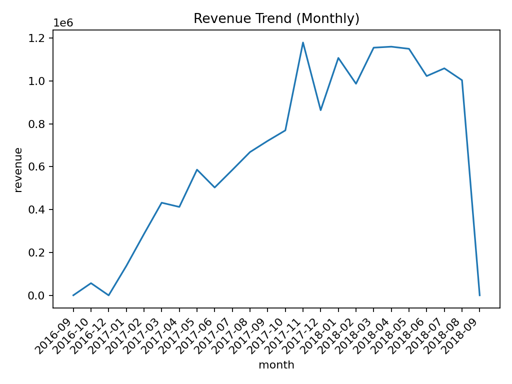
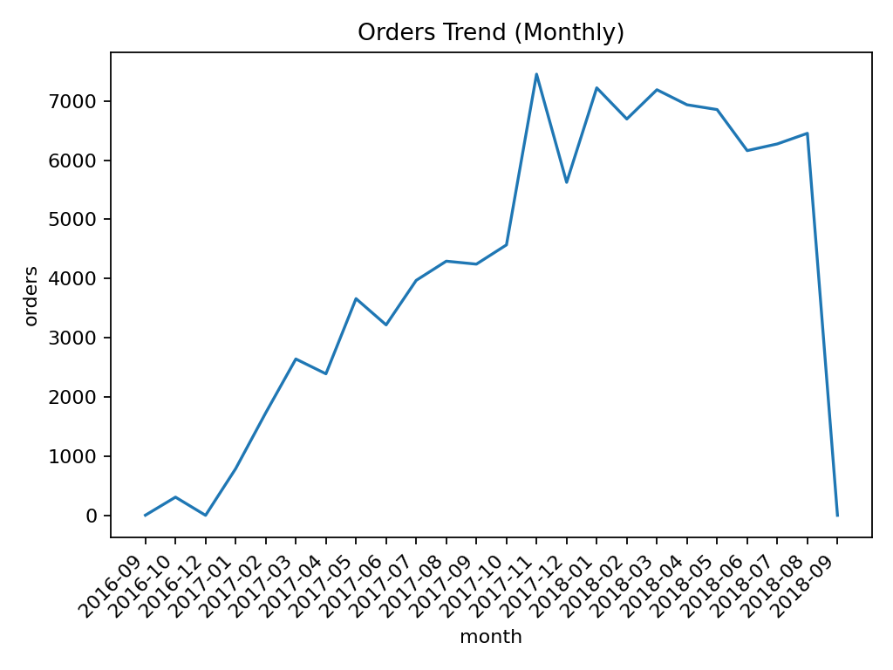
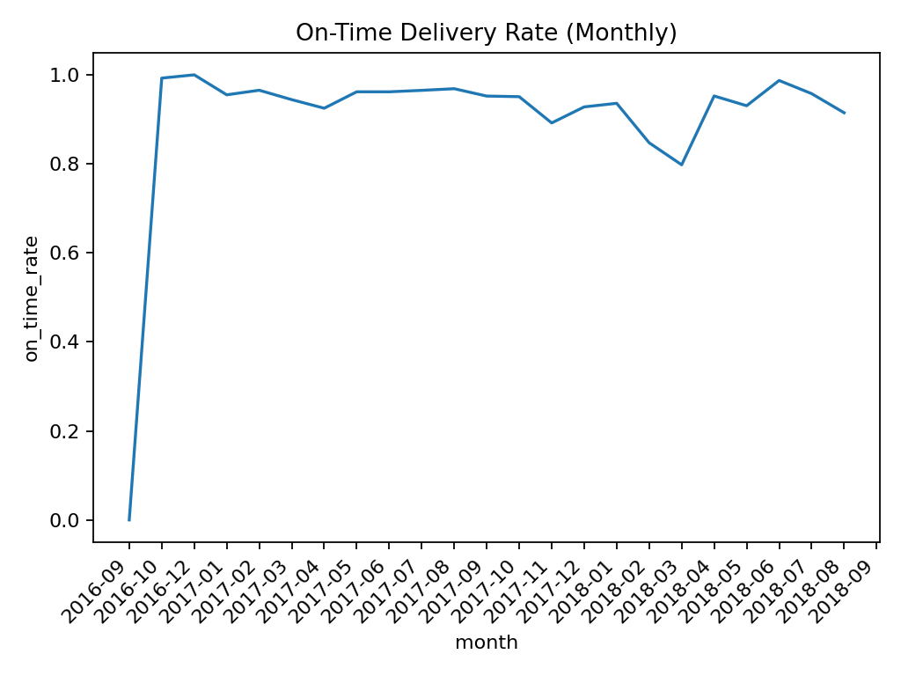
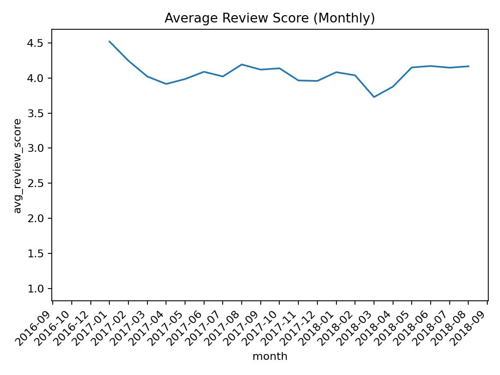
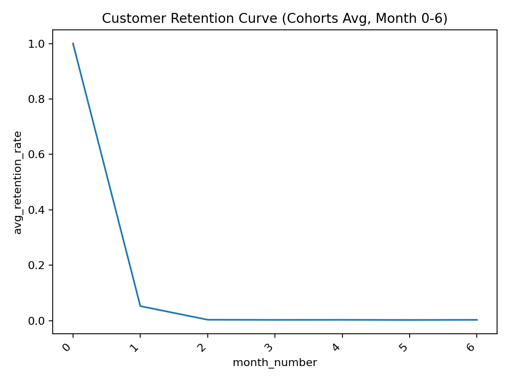
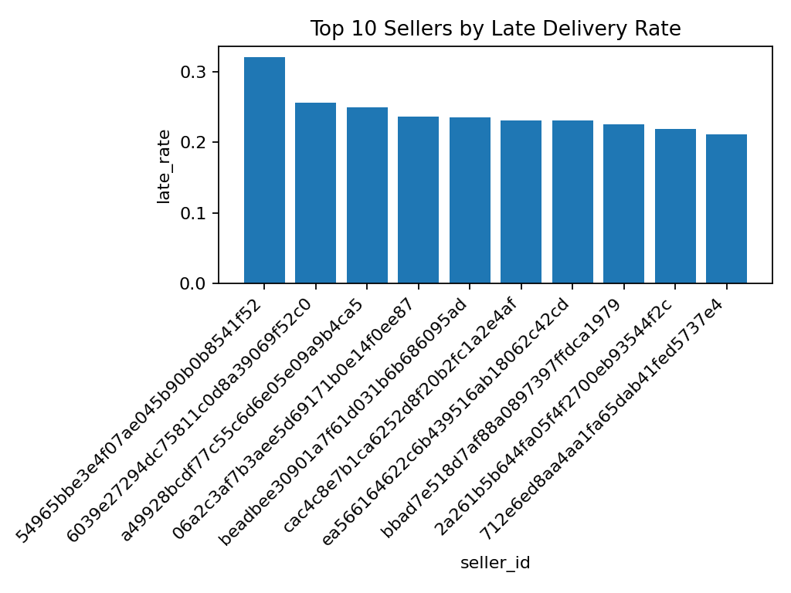

# Olist End-to-End E-Commerce Analytics

An end-to-end analytics project that builds a reproducible SQL pipeline and analyzes
delivery performance, customer retention, and seller reliability using real e-commerce data.

## How to Run This Project (Reproducible)

1. Upload the Olist CSV files into the `/data` folder.
2. Open the repository in GitHub Codespaces.
3. Install dependencies:

       pip install duckdb pandas pyarrow matplotlib

4. Build the full pipeline:

       python - <<'EOF'
       import duckdb
       con = duckdb.connect("olist.duckdb")
       con.execute(open("sql/00_setup/00_build_all.sql").read())
       EOF

5. Generate charts:

       python docs/make_charts.py

All outputs are saved automatically to `/images/dashboard_screenshots`.

## Dashboard Preview (Auto-Generated)

Revenue Trend (Monthly)  

Orders Trend (Monthly)  

On-Time Delivery Rate (Monthly)  

Average Review Score (Monthly)  

On-time vs Late Delivery (Review Impact)  

Customer Retention (Cohort Avg, Month 0–6)  

Worst Sellers by Late Delivery Rate  

## Skills Demonstrated

- End-to-end analytics pipeline design
- SQL data modeling (staging, fact tables, marts)
- Cohort-based customer retention analysis
- Operational KPI analysis (delivery performance)
- Translating data into business recommendations
- Reproducible, version-controlled analytics workflows

## Executive Summary
See `docs/executive_summary.md`.
